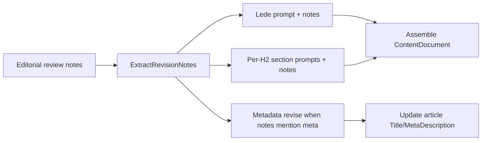

# Tomorrow: rewrite fidelity + Tools per-platform generation

Pickup plan for the next session (written 2026-07-25). Related standing note: [AGENTS.md](../AGENTS.md) — **Pillar Tools section generation (known limitation)**.

## Context from today

- Soft-save word counts, user-driven rewrite UI, no auto-retries, single-tool review — shipped.
- Cold-outreach duplicate body fixed (`FromPlainText` heading).
- Tools H2 truncation mitigated with `8192` tokens — **documented as a ceiling fix** in AGENTS.md (“Pillar Tools section generation”).
- Verified: rewrite refreshes Article state, but **re-review repeats the same critiques** because lede/meta notes never enter the writer prompts, and the reviewer asks for unverifiable stats the writer is forbidden to invent.

## Priority 1 — Make “Rewrite with feedback” actually address reviews

### 1a. Wire revision notes into the lede

- Today: `GenerateArticleBodyAsync` in `ContentGenerationOrchestrator.cs` calls `BuildArticleLedePrompt` with **no** `revisionNotes`.
- Change: add `revisionNotes` to `BuildArticleLedePrompt`; inject `BuildRevisionNotesBlock` scoped to the current lede heading.
- Practical rule: for the lede call, apply notes tagged with the existing lede heading **or** notes whose section title is not in `sectionOutline` (lede-only titles).

### 1b. Apply meta-description / hygiene notes

- Body-only rewrite cannot fix “meta 140–160 chars / no cutting-edge.”
- When extracted notes mention meta description (or structural hygiene on meta), run a small metadata revise path: update `articleRow.MetaDescription` (and title only if explicitly noted) before or after body regen.
- Keep plan/outline stable unless notes explicitly demand outline changes (PAA “remove section” should **not** delete the FAQ H2; prefer reframing guidance in the FAQ section prompt only).

### 1c. Align reviewer with writer rules

- In `EditorialReviewService` rubric: stop demanding “exact fines,” “real-world case studies,” or unverifiable percentages when research context doesn’t support them.
- Prefer: pain-first framing, specificity via labeled hypotheticals, remove/replace invented-sounding absolutes, keyword-as-problem — consistent with existing writer prompts and AGENTS content rules.

### 1d. Tests + light UX

- Unit tests: lede prompt includes `REVISION REQUIRED` when notes target the lede; meta path updates description when notes say so.
- Nice-to-have: after rewrite, focus Article tab or show “Article updated — re-run review.”

## Priority 2 — Tools section: one platform per call (from AGENTS.md)

Already recorded under **Pillar Tools section generation (known limitation)** in AGENTS.md:

> Preferred long-term approach: generate one platform (or one child subtree) per LLM call and assemble them under the Tools H2.

### Implementation sketch

1. First Tools call (or deterministic scaffold): produce Tools H2 shell + ordered list of 4–5 real platform names (lightweight JSON).
2. For each platform: one LLM call returning that platform’s `h3` subtree (overview, capability list, implementer `h4`) — split today’s `BuildToolsSectionGuidance` per child.
3. Assemble children onto the Tools section; keep total word target ~700–900.
4. Drop reliance on `8192` for a single mega-JSON (can lower Tools parent budget once children are separate).
5. Ensure `ToolSectionExtractor` still finds `h3` platforms the same way.

## Out of scope tomorrow

- Persisting `ProjectStore` across Railway restarts (separate product decision; still no DB).
- Restoring automatic review regenerate loops.
- Raising `MaxOutputTokens` further as the primary Tools fix.

## Suggested order of attack

1. Lede notes + reviewer rubric alignment (unblocks the stuck rewrite loop).
2. Meta revise path for hygiene notes.
3. Tools per-platform generation (AGENTS long-term item).
4. Commit/push once; then pause deploys while re-testing end-to-end so in-memory projects aren’t wiped mid-run.

## Docs

- Keep the AGENTS Tools note as the source of truth for Priority 2.
- After Priority 1 ships, add a short **Editorial rewrite** note to AGENTS.md: lede + sections + meta receive notes; reviewer must not demand unverifiable inventable stats.

## Todos

- [x] Pass revision notes into `BuildArticleLedePrompt` / `GenerateArticleBodyAsync` lede call
- [x] Apply meta-description hygiene notes on pillar rewrite
- [x] Align `EditorialReviewService` rubric with no-invented-facts writer rules
- [x] Split Tools H2 into per-platform LLM calls and assemble (AGENTS.md)
- [x] Tests for lede/meta revise; AGENTS editorial-rewrite note
- [ ] Single deploy then pause while re-testing end-to-end (in-memory projects)
